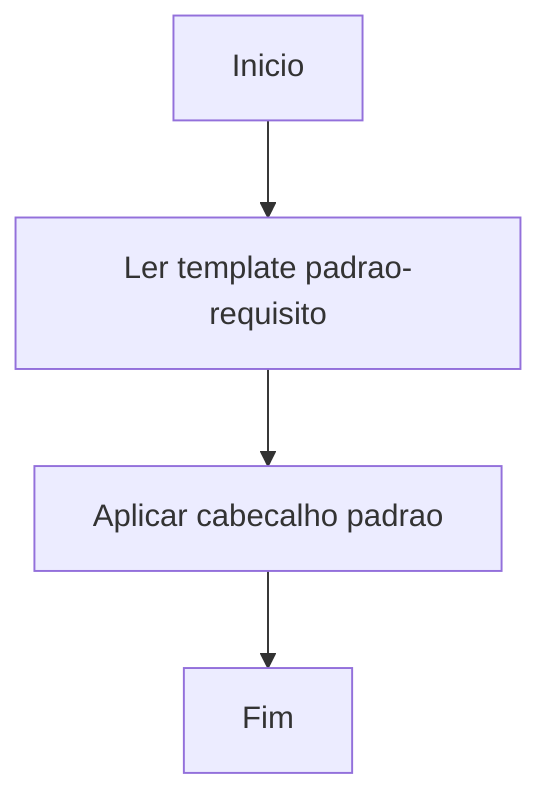

# Regras de Desenvolvimento

## Workflow de Atividades

### Regras Principais (devem ser realizadas de imediato)

- Regra 1: Consultar `README.md` (tecnologias e informações do projeto) e `docs/ESTRUTURA.md` (organização, estrutura de diretórios e localização de arquivos) antes de iniciar qualquer atividade.
- Regra 2: Criar arquivo de workflow `yyyy-MM-dd-workflow-nome-da-atividade.md` em `docs/workflow/`. Obter data com `powershell -Command Get-Date -Format "yyyy-MM-dd"` (Windows) ou `date +%Y-%m-%d` (Linux) e elaborar fluxograma Mermaid para mapear a lógica da atividade. <!-- Requer extensão Markdown Preview Mermaid Support -->

#### Mermaid (workflows) - evitar erros de parse

Para reduzir falhas de renderização do Mermaid entre diferentes visualizadores, padronize os textos (labels) dos nós do `flowchart` com **caracteres simples**.

**Regras práticas:**

1. Evitar acentos e caracteres especiais nos labels (ex.: usar `Inicio` em vez de `Início`).
2. Evitar parênteses `()` e colchetes `[]` dentro dos labels.
3. Evitar pontos `.` e extensões em labels (ex.: usar `padrao-requisito` em vez de `padrao-requisito.md`).
4. Preferir labels curtos e objetivos.

**Exemplo seguro:**



- Regra 3: Atualizar workflow continuamente, registrando cada etapa relevante do progresso.
- Regra 4: Ao finalizar, atualizar `ESTRUTURA.md` e registrar no changelog diário `docs/changelog/yyyy-MM/yyyy-MM-dd.md` (um único arquivo por dia, ex: `2025-10-15.md`) com todas as alterações seguindo o padrão abaixo. Múltiplas atividades do mesmo dia devem ser adicionadas ao mesmo arquivo. Não incluir arquivos .md de workflow no `ESTRUTURA.md`.

#### Padrão de Changelog

**Formato do Arquivo:**

- **Nome:** `docs/changelog/AAAA-MM/AAAA-MM-DD.md`
- **Título:** `# Changelog AAAA-MM-DD`

**Estrutura de Cada Registro:**

```markdown
- 🏷️ **Status:** [⏳] Pendente | [✅] Concluído
- 📅 **Data:** AAAA-MM-DD
- 📝 **Atividade:** Titulo resumido da alteracao
- 🎯 **Objetivo:** Descrever o Objetivo principal da Atividade
- 📂 **Locais:** `caminho/do/arquivo.ext`
- 🛠️ **Implementacoes:**
  - Detalhar as principais acoes executadas
  - Incluir quantos itens forem necessarios
- ✅ **Resultado:** Resumo do impacto ou beneficio gerado.
```

**Exemplo Completo:**

```markdown
# Changelog 2026-04-20

- 🏷️ **Status:** [✅] Concluído
- 📅 **Data:** 2026-04-20
- 📝 **Atividade:** Adição da tela de Lançar Pontos
- 🎯 **Objetivo:** Permitir que o professor lance pontos para alunos de uma casa.
- 📂 **Locais:** `frontend/src/pages/professor/LancarPontos.jsx`, `backend/src/controllers/lancamentos.controller.js`
- 🛠️ **Implementacoes:**
  - Criação de tela em React para os professores inserirem pontuação.
  - Adição de endpoint POST para cadastrar os pontos.
- ✅ **Resultado:** Professores podem salvar lançamentos de pontos no banco de dados.

---

- 🏷️ **Status:** [✅] Concluído
- 📅 **Data:** 2026-04-20
- 📝 **Atividade:** Correção de interface Mobile do Placar
- 🎯 **Objetivo:** Melhorar a visualização das casas em telas pequenas.
- 📂 **Locais:** `frontend/src/pages/public/Dashboard.jsx`
- 🛠️ **Implementacoes:**
  - Ajuste nas classes TailwindCSS para layout flex em grid column.
  - Normalização de fontes e gap na responsividade.
- ✅ **Resultado:** O placar agora não quebra em dispositivos móveis.
```

**Regras de Formatação:**

1. **Separador:** Use `---` entre registros múltiplos
2. **Data:** Formato `AAAA-MM-DD` (ex: 2025-12-15)
3. **Locais:** Use crases para caminhos de arquivos
4. **Implementações:** Lista com `-` e 2 espaços de indentação
5. **Ordem:** Registro mais recente primeiro no arquivo do dia

- Regra 5: Realizar uma revisão completa de todas as alterações antes de encerrar a atividade. Registrar no workflow se houve erro identificado; caso exista, corrigir imediatamente e documentar a solução. Caso contrário, registrar que nenhum erro foi encontrado.
- Regra 6: **Proibição de Commits Automáticos**. É estritamente proibido realizar commits (`git commit`) sem a solicitação ou confirmação explícita do usuário. O agente deve preparar os arquivos (`git add`), mostrar o status e aguardar a ordem para commitar.

IMPORTANTE: Preservar os acentos e emojis durante qualquer edição ou revisão de texto.
IMPORTANTE: Arquivos `.md` devem ser salvos em UTF-8 sem BOM para manter compatibilidade com acentos e ç.

### Passos do Workflow

1. Análise Inicial:
   - Analisar código existente e pontos de integração
   - Identificar recursos necessários e implementações reutilizáveis
   - Documentar dependências e requisitos técnicos

2. Para cada nova tarefa:
   - Registrar tudo no arquivo `yyyy-MM-dd-workflow-nome-da-atividade.md`
   - Detalhar passos e dividir em etapas gerenciáveis
   - Usar marcadores: [⏳] Pendente | [✅] Concluído | [❌] Problema | [🔄] Em desenvolvimento

3. Processo de Desenvolvimento:
   - Implementar um passo por vez seguindo a ordem estabelecida
   - Atualizar workflow conforme cada etapa é concluída
   - Prosseguir sem solicitar confirmações intermediárias até conclusão total
   - Documentar decisões técnicas importantes

4. Boas Práticas:
   - Manter workflow atualizado com progresso e observações relevantes
   - Registrar desvios do plano original
   - Documentar configurações de ambiente e termos técnicos específicos

5. Finalização:
   - Marcar etapas como concluídas
   - Revisar resultado final
   - Documentar lições aprendidas e elaborar testes de validação

6. Registro de Erros:
   - Documentar cada erro encontrado com descrição detalhada
   - Marcar [⏳] erros pendentes e [✅] erros solucionados
   - Descrever correções implementadas
