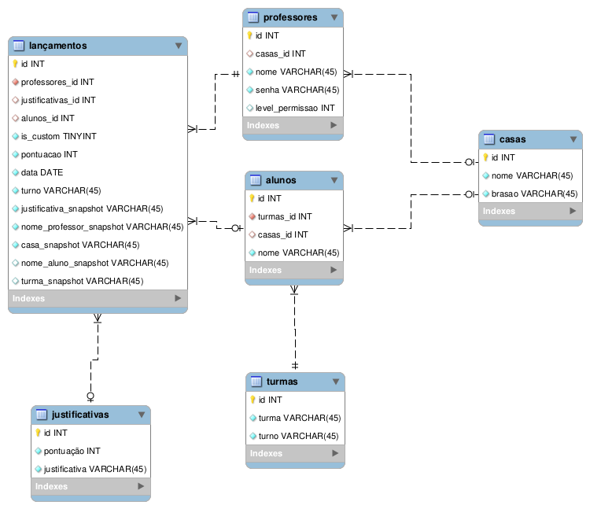

# Documento de Engenharia de Software - Taça das Casas

## 1. Visão Geral do Projeto

O **Taça das Casas** é uma aplicação web no formato **Web App (PWA)**, desenvolvida com abordagem *mobile-first*, destinada a gerenciar as gincanas internas da escola CEF 102 Norte. O sistema tem como objetivo principal digitalizar e modernizar o controle de pontuações, substituindo métodos manuais por uma plataforma centralizada e em tempo real.

O projeto possui diferentes perfis de acesso, definindo permissões específicas para Alunos/Público, Professores e Coordenação/Diretoria, garantindo a integridade dos lançamentos e a transparência para a comunidade escolar.

---

## 2. Requisitos Funcionais (RF)

Os requisitos funcionais descrevem os comportamentos, recursos e funções que o sistema deve fornecer aos seus usuários, de acordo com o levantamento feito no Backlog do produto.

| ID | Nome / Resumo | Descrição | Prioridade |
|:---|:---|:---|:---|
| **RF01** | Visualização do Placar | O placar com o ranking das equipes deve ficar aberto para alunos e comunidade acompanharem a gincana, sem exigir criação de conta. | Alta |
| **RF02** | Login Separado | Professores e a equipe da coordenação devem usar uma tela de login para conseguir entrar nos seus respectivos painéis de controle. | Alta |
| **RF03** | Dar Pontos | Os professores podem lançar pontos ganhos para as equipes, sempre amarrando os pontos a uma das provas da gincana. | Alta |
| **RF04** | Criar Provas | A coordenação precisa de uma ferramenta para adicionar, editar ou excluir os tipos de provas e brincadeiras válidas da gincana. | Alta |
| **RF05** | Poder Total nos Pontos | A coordenação acessa e altera o sistema todo, podendo apagar ou modificar qualquer nota lançada por outras pessoas para corrigir injustiças. | Alta |
| **RF06** | Corrigir Próprio Erro | Cada professor deve ter a permissão de corrigir as notas e pontos que ele mesmo digitou, para arrumar pequenos deslizes. | Média |
| **RF07** | Controlar Equipes | A coordenação pode registrar, excluir e atualizar o nome e dados das Casas/equipes concorrentes do torneio. | Alta |
| **RF08** | Criar Turmas | O sistema deve deixar a escola cadastrar todas as suas turmas ativas e quais alunos pertencem a cada uma. | Média |
| **RF09** | Filtrar Pontuações | Devem existir botões de filtro para organizar a leitura da lista gigante de histórico de pontos, focando só numa turma, casa ou prova específica. | Média |
| **RF10** | Gerar Planilhas | A coordenação pode apertar um botão e baixar um arquivo CSV para ler o histórico de toda a gincana no seu Excel ou imprimir. | Baixa |
| **RF11** | Zerar para Novo Ano | A direção precisa de um recurso de arquivamento total que apague ou esconda o passado e zere o placar inteiro, reabrindo a arena para um novo ano letivo. | Alta |
| **RF12** | Gerenciar Acessos | A coordenação precisa de telas exclusivas para criar as senhas de professores novos ou bloquear aqueles que perderam permissão. | Média |

---

## 3. Requisitos Não Funcionais (RNF)

Os requisitos não funcionais determinam as restrições gerais, usabilidade e características do funcionamento prático do ambiente do sistema.

| ID | Categoria | Descrição Simples |
|:---|:---|:---|
| **RNF01** | **Usabilidade Visual** | O sistema precisa ser responsivo para ter uma visualização e navegação fluida em celulares e tablets, além do uso normal no computador. |
| **RNF02** | **Acesso via Atalho** | O sistema deve ser acessível na tela do celular através de um ícone criado pelo próprio navegador, funcionando como se fosse um aplicativo nativo instalado. |
| **RNF03** | **Fluidez da Tela** | O site deve carregar os componentes rapidamente, mantendo uma experiência visual ininterrupta e sem recarregar e piscar a página interativa de placar. |
| **RNF04** | **Construção de Servidor** | O motor por trás do sistema deve ser seguro o suficiente para processar vários pacotes de dados sem travamentos excessivos no momento de pico. |
| **RNF05** | **Organização de Dados** | As fichas de dados salvos (tabelas e pontos) devem manter extrema correlação. Uma equipe apagada não pode desorganizar suas devidas pontuações e vice-versa. |
| **RNF06** | **Disponibilidade Web** | O aplicativo precisa ficar ancorado numa central online de alta consistência que mantenha ele ativo 24h na nuvem para não prejudicar as visitas noturnas e fora do ar. |
| **RNF07** | **Distribuição Rápida** | A rede de distribuição deve evitar com que se perca conexão quando diferentes celulares simultâneos entrem para verificar o placar atual das gincanas. |
| **RNF08** | **Recuperação Automática** | O código precisa ter inteligência de reiniciar a si mesmo num caso brusco de falha do programa ou de queda, não exigindo alguém da escola ir ligar e reiniciar computadores. |
| **RNF09** | **Proteção de Acesso** | Dados transferidos (notas, login com senhas etc) exigem ser totalmente criptografados via certificado forte (cadeadinho verde no navegador ou acesso HTTPS blindado). |
| **RNF10** | **Separação Rigorosa** | Sob nenhuma hipótese o sistema deve cruzar permissões na tela ou no próprio painel – o visitante nem deve enxergar botões de lançamento. |

---

## 4. Modelagem do Banco de Dados (Modelo Lógico)

Abaixo é apresentado o Diagrama Entidade-Relacionamento representando as tabelas do sistema e suas conexões lógicas.

### 4.1 Decisões de Modelagem e Normalização

Na concepção do banco de dados, **as regras e formas normais de estruturação foram rigorosamente seguidas** para a maioria das tabelas, garantindo a prevenção de anomalias (inserção, atualização, exclusão) e reduzindo as redundâncias.

**Exceção Estratégica na Tabela de Lançamentos:**
A única exceção a esta regra encontra-se na tabela de **lançamentos (pontuações)**. Foi adotada uma desnormalização proposital nesta entidade pelos seguintes motivos:

1. **Manutenção do Histórico Intacto:** Ao registrar certos dados consolidados diretamente no lançamento, "congelamos" o estado da informação naquele momento. Caso referências históricas sejam editadas ou excluídas no futuro na tabela principal, o histórico do lançamento não sofrerá mutação ou quebra de dados.
2. **Agilidade nas Consultas (Queries):** A tabela de lançamentos é a mais acessada e crítica do sistema, tanto para leitura (atualização de placares) quanto para gravação. Reduzir a necessidade de múltiplos *joins* (junções de várias tabelas) garante uma execução muito mais rápida, performática e econômica das *queries* necessárias para montar o ranking em tempo real.

---

## 5. Diagrama de Arquitetura do Sistema

O sistema emprega uma arquitetura do tipo **Cliente-Servidor**, estruturada no modelo clássico de três camadas, sendo fortemente dependente de um servidor na nuvem orquestrando as requisições web.

Abaixo é apresentado um diagrama arquitetural detalhado do modelo de implantação da aplicação:

### 5.1 Breve Descrição dos Componentes

- **Clientes / Posição Frontal:** O usuário acessa a plataforma via smartphone ou desktop. O sistema roda no modelo PWA direto no browser.
- **Nginx:** Atua na porta 80 e 443 como o portal de entrada principal do projeto. Todas as requisições HTTPS originadas pela Internet batem no Nginx. Ele decide para onde rotear a demanda. Se a busca é por recursos assíncronos como imagens ou pela interface, ele entrega os artefatos gerados pelo build do React; seções da URL marcadas para dados da gincana, ele redireciona como *Proxy Reverso* à API do Node.
- **Node.js (Express) e PM2:** A API RESTful fica encapsulada e protegida pelas regras do Nginx e roda em background contínuo graças ao **PM2**, fornecendo ou validando JWT e conectando-se ao banco de dados utilizando queries.
- **Banco de Dados (MariaDB):** Componente de armazenamento relacional, validando a integridade entre turmas, pontos, contas de professores e demais entidades da gincana.
