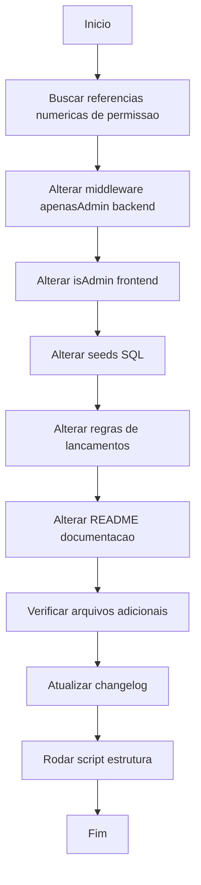

# Workflow: Alterar Valores Numéricos de Permissão

## Data

2026-04-20

## Objetivo

Inverter os valores numéricos dos perfis de acesso no projeto inteiro: **Admin passa a ser `1` e Professor passa a ser `2`** (antes era Professor=1, Admin=2).

## Fluxograma

## Etapas

- [✅] Buscar todas as referências numéricas a `permissao` no projeto (grep/search)
- [✅] `backend/src/middlewares/auth.middleware.js` — `apenasAdmin`: `!== 2` → `!== 1`
- [✅] `frontend/src/context/AuthContext.jsx` — `isAdmin`: `=== 2` → `=== 1`; `isProfessor`: `=== 1` → `=== 2`
- [✅] `backend/init.sql` — seed Coordenacao: `permissao = 2` → `permissao = 1`
- [✅] `sql/init.sql` — seed Coordenacao: `permissao = 2` → `permissao = 1`
- [✅] `backend/src/services/lancamentos.service.js` — comentários e condições: `permissao === 1` (prof) → `=== 2`; `!== 2` (admin) → `!== 1`
- [✅] `backend/src/repositories/auth.repository.js` — middleware duplicado `apenasAdmin`: `!== 2` → `!== 1`
- [✅] `frontend/src/views/admin/AdminProfessores.jsx` — `FORM_VAZIO.permissao`: `1` → `2` (professor padrão)
- [✅] `README.md` — tabela de perfis, exemplo de login (`permissao: 2` → `1`), seção Admin (`permissao: 2` → `1`)
- [✅] Atualizar `docs/changelog/2026-04/2026-04-20.md`
- [⏳] Rodar `node scripts/gerar-estrutura-arquivos-linhas.js`

## Observações

- Não houve necessidade de alterar `backend/src/services/auth.service.js` nem `backend/src/controllers/auth.controller.js`, pois ambos retornam a permissão dinamicamente do banco de dados (sem hardcoded).
- O banco está limpo, portanto não foi necessário migration de dados.
