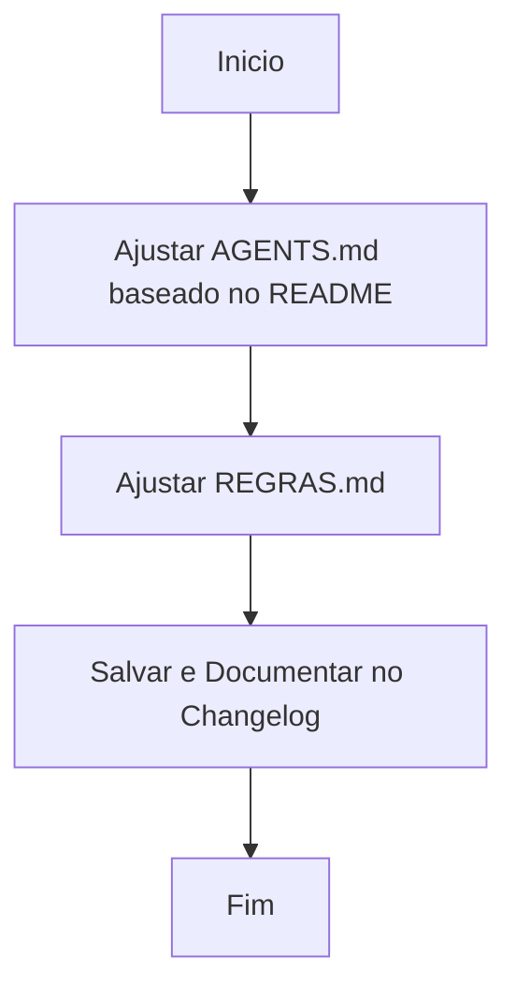

# Workflow: Atualizar Regras e Agentes

- [⏳] Ajustar AGENTS.md com as frentes de tecnologia (React+Node).
- [⏳] Atualizar nomes e estruturas de pastas referenciadas no AGENTS.md para refletir o projeto real.
- [⏳] Ajustar docs/REGRAS.md para assegurar que está alinhado com o contexto.
- [⏳] Finalizar documentação e gerar arquivo de changelog.
