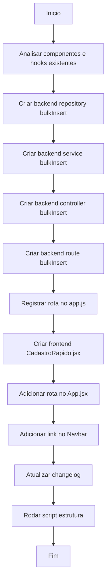

# Workflow: Cadastro Rápido (Bulk Insert)

## Data

2026-04-20

## Objetivo

Criar uma tela unificada de cadastro em lote para Alunos, Professores, Turmas e Justificativas, permitindo ao admin preencher, acumular em uma lista de rascunho e salvar tudo de uma vez via transação MariaDB.

## Fluxograma

## Etapas

- [✅] Analisar componentes existentes (`useCrud`, `CrudTable`, `Input`, `Select`, `Modal`, `Button`, `Card`)
- [✅] Criar `backend/src/repositories/bulkInsert.repository.js` — transação MariaDB (BEGIN → INSERTs → COMMIT/ROLLBACK)
- [✅] Criar `backend/src/services/bulkInsert.service.js` — validação de whitelist, campos obrigatórios, hash de senha
- [✅] Criar `backend/src/controllers/bulkInsert.controller.js` — recebe HTTP, delega para service
- [✅] Criar `backend/src/routes/bulkInsert.routes.js` — POST /api/bulk-insert com middleware admin
- [✅] Registrar rota em `backend/src/app.js`
- [✅] Criar `frontend/src/views/admin/CadastroRapido.jsx` — formulário dinâmico, lista de rascunho, salvar em lote
- [✅] Adicionar rota `/cadastro-rapido` em `frontend/src/App.jsx`
- [✅] Adicionar link "Cadastro Rápido" em `frontend/src/components/Navbar.jsx`
- [⏳] Atualizar `docs/changelog/2026-04/2026-04-20.md`
- [⏳] Rodar `node scripts/gerar-estrutura-arquivos-linhas.js`

## Observações

- A view reutiliza componentes existentes (`Input`, `Select`, `Button`, `Card`, `LoadingSpinner`) para manter o DRY e a paleta de cores.
- A configuração de metadados por tabela (`CONFIG_TABELAS`) permite extensão futura sem criar novas views.
- Tabelas excluídas do cadastro rápido: `casas` (cadastro simples, 2 campos) e `lancamentos` (lógica complexa com FKs múltiplas).
- A transação no banco garante que todos os itens são inseridos ou nenhum é, evitando dados parciais.
