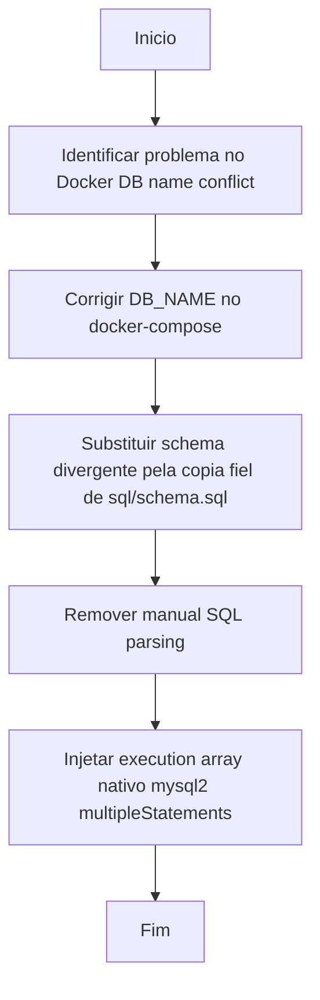

# 2026-04-20 - Corrigir Migrations

- [✅] Identificar problema no Docker DB name conflict
- [✅] Corrigir DB_NAME no docker-compose
- [✅] Remover statements perigosos (CREATE DATABASE/USE) de migrations
- [✅] Copiar `sql/schema.sql` como fonte da verdade em `001_create_schema.sql`
- [✅] Substituir parse manual por nativo de pool connection (multipleStatements) no runMigrations.js
- [✅] Finalizar documentação e changelog
