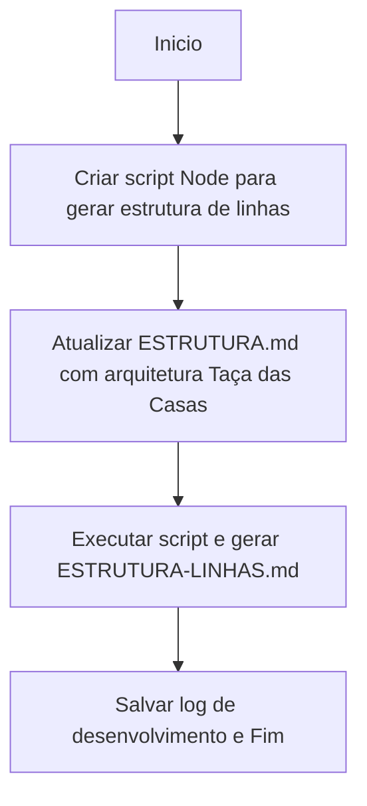

# Workflow: Criar script de mapeamento estrutural e atualizar guia arquitetural

- [⏳] Configurar `scripts/gerar-estrutura-arquivos-linhas.js`
- [⏳] Refletir nova realidade no `ESTRUTURA.md` (`frontend`, `backend`, `database`)
- [⏳] Rodar o script e gravar `ESTRUTURA-LINHAS.md`
- [⏳] Atualizar `changelog`.
