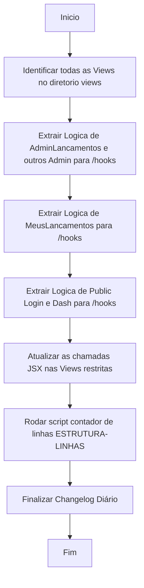

# Workflow: Refatoração MVC do Frontend (Views)

- **Data:** 2026-04-20
- **Atividade:** Desacoplamento da Lógica JS de todas as Views React em *Controller Hooks* separados.

## Fluxograma

## Etapas do Processo

- [✅] **1. Mapeamento das Views Existentes**
  - Identificados 9 arquivos complexos: `AdminAlunos`, `AdminCasas`, `AdminJustificativas`, `AdminLancamentos`, `AdminProfessores`, `AdminTurmas`, `MeusLancamentos`, `Dashboard`, `Login`.
  
- [⏳] **2. Criação dos Controllers React (Hooks)**
  - Para cada View, extrair métodos lógicos (`useState`, `useEffect`, `handleSubmit`, `carregarDados`) em arquivos separados sob `/src/hooks/use[NomeDaView].js`.
  
- [⏳] **3. Limpeza UI das Views (JSX Puro)**
  - As Views originais apenas farão o import dos hooks e farão destructuring de estado e funções, renderizando o TailwindCSS retornado do padrão de MVC de interface.
  
- [⏳] **4. Encerramento e Documentação Final**
  - Atualizar regras da arvore de documentação no script e preencher Changelog diário.
