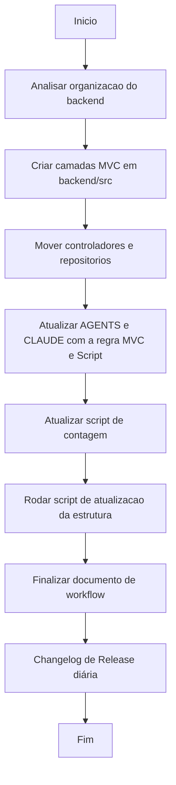

# Workflow: Refatoração para Arquitetura MVC (Backend)

- **Data:** 2026-04-20
- **Atividade:** Refatoração estrita do Backend para a arquitetura MVC (Model-View-Controller) com Node.js e atualização das diretrizes globais para IAs (AGENTS/CLAUDE).

## Fluxograma

## Etapas do Processo

- [✅] **1. Análise Inicial**
  - Código fonte estava utilizando `require` orientados a camadas (`require('../controllers/alunos.controller')`), mas as pastas estavam agrupadas em raiz por blocos de domínio (`backend/alunos/`). Isso criava corrupção de rota e incongruência com as diretrizes listadas no `AGENTS.md`.

- [✅] **2. Migração Estrutural da base Node (Backend)**
  - Geração segura de diretórios centrais de arquitetura separada em `backend/src/`: `controllers/`, `middlewares/`, `repositories/`, `routes/`, `services/`, e `config/`.
  - Migração física em loop de dezenas de `*.js` baseada em sua destinação MVC específica para dentro das relativas pastas.
  - Limpeza completa dos espólios/diretórios legados de domínio na raiz `backend/`.

- [✅] **3. Atualização de IAs para Mandato Fixo**
  - Edição forte nos arquivos guia (`AGENTS.md` e `CLAUDE.md`), reformulando a seção de arquitetura para ditar objetivamente a estrita **Arquitetura MVC**.
  - Acréscimo do requisito inegociável na etapa 7 (Finalização) mandando rodar sempre via terminal o script `node scripts/gerar-estrutura-arquivos-linhas.js`.

- [✅] **4. Revisão Automobilística e Árvore Documental**
  - Refatoração do script Javascript `gerar-estrutura-arquivos-linhas.js` para mapear corretamente nos relatórios as lógicas oriundas das pastas de camada do `backend/src/`.
  - Execução validada que reconstruiu o map `docs/ESTRUTURA-LINHAS.md`.
  - Adaptação na unha da casca manual de `docs/ESTRUTURA.md`.

## Erros Iniciais e Solucões

- **Registro de Problema:** [✅] A arquitetura proposta não rodaria em tempo de execução devidos as alocações físicas em desacordo com as exportações em `routes`.
- **Solucionado:** O enquadramento na pasta `src/` corrigiu inteiramente as importações sem a necessidade de reescrever lógica interna nos componentes.

## Decisões Técnicas

- Centralizado as configs essenciais (`database.js`) no `config/`, e as subidas instanciadas primárias (`app.js`, `index.js`) coladas à base da `src/`, respeitando as melhores práticas do ecossistema Express.js.
