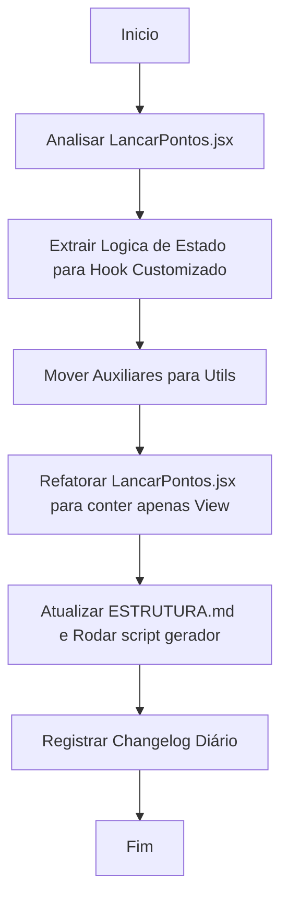

# Workflow: Refatoração da View LancarPontos.jsx

- **Data:** 2026-04-20
- **Atividade:** Desacoplamento de Lógica da View (MVC no React)

## Fluxograma

## Etapas do Processo

- [🔄] **1. Analisar Arquivo**
  - Identificado 400+ linhas concentrando requisições Axios, Handlers, Validação de Formulário e UI (JSX).
- [⏳] **2. Separação de Preocupações (MVC React)**
  - O estado, validações e requisições devem atuar como o *Controller*. Eles irão para `frontend/src/hooks/useLancarPontos.js`.
- [⏳] **3. Limpeza do Arquivo**
  - `LancarPontos.jsx` será reduzido apenas para injetar o hook e desenhar o DOM/Tailwind.
- [⏳] **4. Conformidade e Scripts**
  - Atualizar changelog e `ESTRUTURA-LINHAS.md`.

## Erros Iniciais e Solucões
- Nenhum por enquanto.
