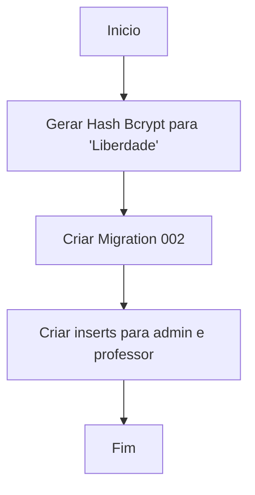

# 2026-04-21 - Criação de Usuários Base

```mermaid
flowchart TD
    A[Inicio] --> B[Gerar Hash Bcrypt para 'Liberdade']
    B --> C[Criar Migration 002]
    C --> D[Criar inserts para admin e professor]
    D --> E[Fim]
```

- [✅] Gerar Hash Bcrypt para 'Liberdade'
- [✅] Criar Migration 002_insert_default_users.sql
- [✅] Criar inserts (admin: perm=1, professor: perm=2)
