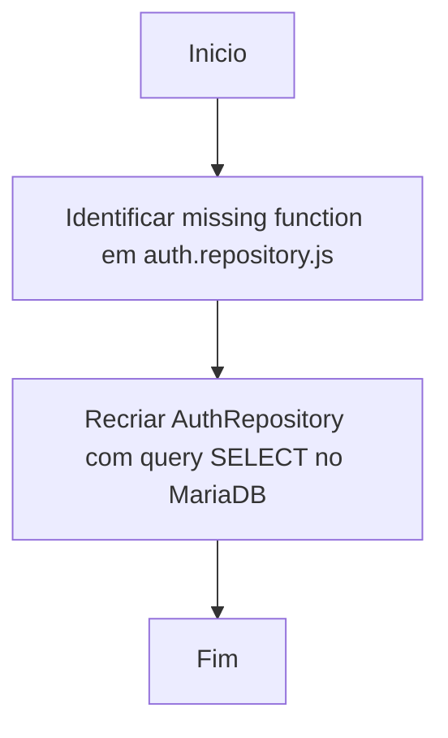

# 2026-04-21 - Hotfix AuthRepository

```mermaid
flowchart TD
    A[Inicio] --> B[Identificar missing function em auth.repository.js]
    B --> C[Recriar AuthRepository com query SELECT no MariaDB]
    C --> D[Fim]
```

- [✅] Identificar arquivo sobrescrito
- [✅] Recriar `buscarPorNome` com conexão `pool.query`
