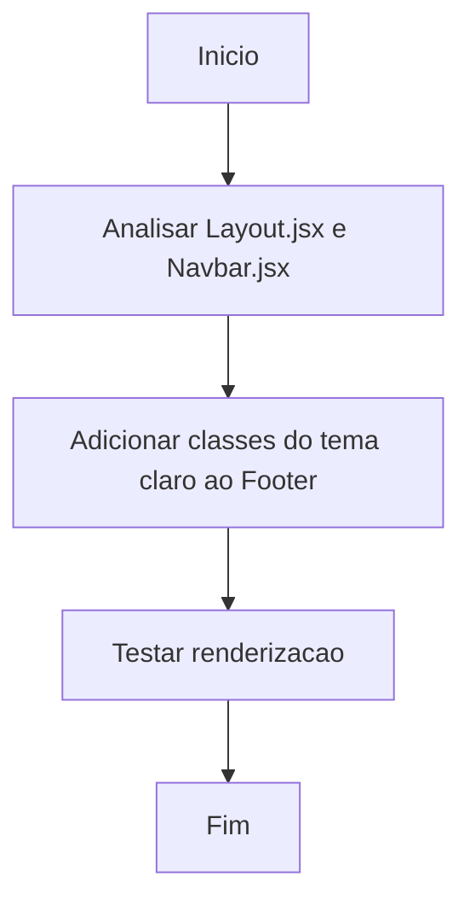

# Workflow: Atualização do Estilo do Footer

- [✅] Concluído
- **Data:** 2026-04-27
- **Objetivo:** Garantir que o Footer siga o mesmo padrão da Navbar no tema claro.

## Passos:
- [✅] Inserir classes bg-background-800 e border-background-600 no footer em `Layout.jsx`
- [✅] Nenhuma outra modificação de CSS foi necessária.
- [✅] Nenhum erro identificado.
