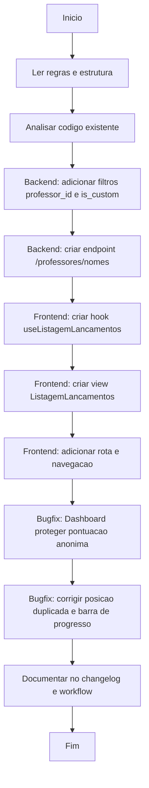

# Workflow: Listagem de Lancamentos com Filtros Avancados

## Data

2026-04-27

## Objetivo

Criar uma view de listagem de lancamentos acessivel a todos os usuarios autenticados (professores e admin) com filtros por casa, professor, periodo de data e tipo de justificativa (customizada vs pre-definida). Corrigir Dashboard para ocultar dados sensiveis de usuarios anonimos.

## Fluxo (Mermaid)

## Etapas

- [x] Analise inicial do schema, repository, controller e hooks existentes
- [x] Backend: expandir filtros `is_custom` em `lancamentos.repository.js`
- [x] Backend: expor parametros `professor_id` e `is_custom` em `lancamentos.controller.js`
- [x] Backend: criar endpoint `GET /api/professores/nomes` para dropdown de professores
- [x] Frontend: criar hook `useListagemLancamentos.js`
- [x] Frontend: criar view `ListagemLancamentos.jsx` (inicialmente em `public/`, depois movido para `professor/`)
- [x] Frontend: registrar rota `/lancamentos` em `App.jsx`
- [x] Frontend: adicionar link "Listagem" ao lado de "Lancar Pontos" no `Navbar.jsx`
- [x] Bugfix Dashboard: ocultar pontuacao para usuarios nao logados; mostrar `***` com botao de olho para logados
- [x] Bugfix Dashboard: remover posicao duplicada (coluna da direita para anônimos); usar `º` ao inves de `o`
- [x] Bugfix Dashboard: remover contagem de lancamentos do card
- [x] Bugfix Dashboard: remover barra de progresso para nao revelar distancia entre casas
- [x] Bugfix `useLancarPontos.js`: adicionar `is_custom` ao `buildPayload`
- [x] Finalizacao: ESTRUTURA.md, script estrutura e changelog
