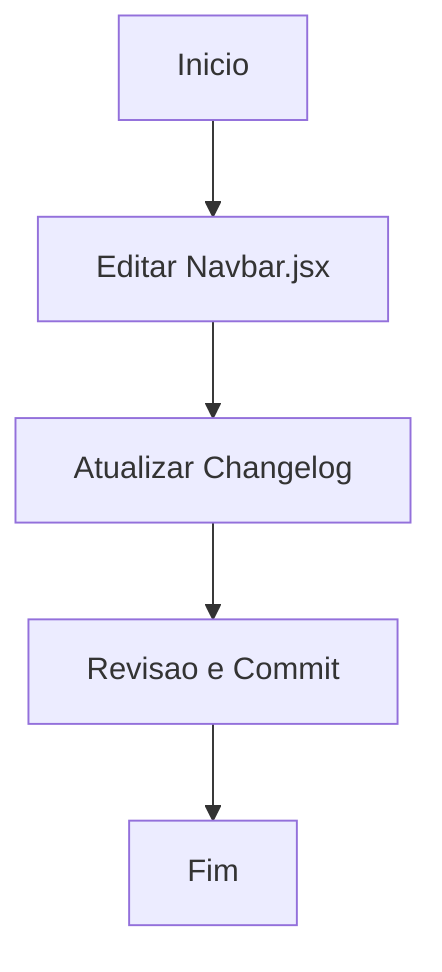

# Workflow: Ajustes Navbar

## Tarefas
- [✅] Remover "Meus Lançamentos" da visualização mobile e desktop.
- [✅] Renomear link de "Listagem" para "Lançamentos".
- [✅] Atualizar o Changelog do dia 2026-04-27 com as atividades mais recentes.
