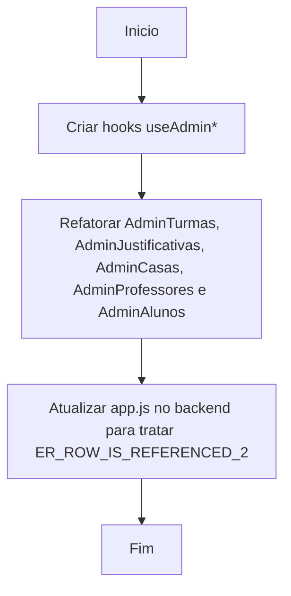

# Workflow: Refatoração MVC das Views Administrativas e Bloqueio de Exclusão

- [✅] Concluído
- **Data:** 2026-04-27
- **Objetivo:** Aplicar padrão MVC nas views do painel admin e bloquear exclusão de itens que são foreign keys em outras tabelas.

## Passos:
- [✅] Criação dos hooks `useAdminAlunos`, `useAdminCasas`, `useAdminJustificativas`, `useAdminProfessores` e `useAdminTurmas`.
- [✅] Substituição da lógica nos componentes View.
- [✅] Interceptação de erro `ER_ROW_IS_REFERENCED_2` no middleware global do `app.js` para retornar mensagem amigável sem usar DELETE CASCADE.
- [✅] Nenhum erro identificado.
