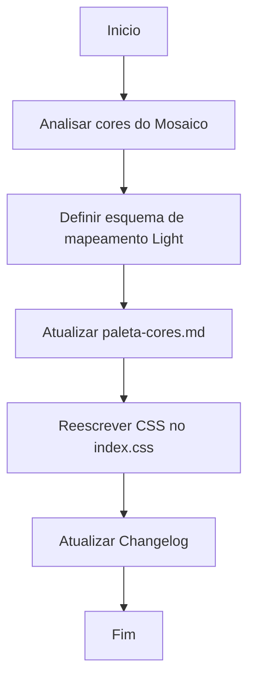

# Workflow: Reformulação de Cores do Tema Claro

## Tarefas
- [✅] Ler as cores do arquivo `docs/tiles cores.md`.
- [✅] Adicionar a seção do Tema Claro ao `agentes/paleta-cores.md`.
- [✅] Substituir o CSS da classe `.theme-light` no `index.css` com as cores do Mosaico (`#fdfefe`, `#fdcb14`, `#158ad3`, etc) e suporte a *glassmorphism* (backdrop-filter) para os cards.
- [✅] Atualizar o Changelog de hoje.
