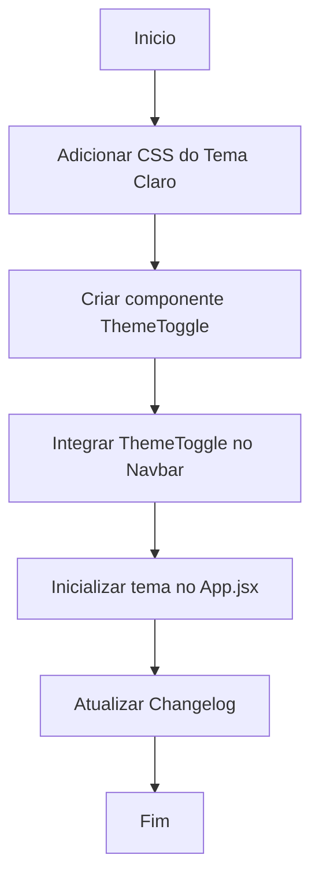

# Workflow: Criação do Tema Claro e Background Replicável

## Tarefas
- [✅] Criar regras CSS `.theme-light` no `index.css` que aplicam o fundo `mosaico_geometrico_tille.png` com `repeat`.
- [✅] Substituir utilitários e cores em `.theme-light` globalmente para simular o tema claro sem refatorar todo o Tailwind.
- [✅] Criar botão de alternância de tema (`ThemeToggle.jsx`).
- [✅] Inserir `ThemeToggle` no `Navbar.jsx`.
- [✅] Inserir inicializador no `App.jsx` para evitar *flicker* na página de Login.
- [✅] Atualizar o Changelog do dia 2026-04-27.
