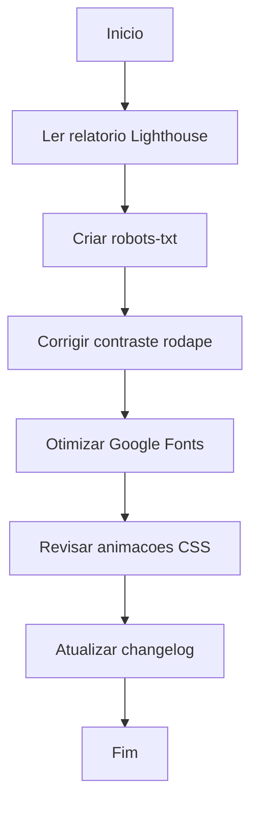

# Workflow - Ajustes Google Lighthouse

## Objetivo
Aplicar correções identificadas no relatório do Google Lighthouse e implementar pacote completo de polimentos finais: Correções Mobile, UI/UX, Modal de Exclusão e PWA.

## Data
2026-04-28

## Fonte de Referencia
`docs/googleLightHouse.md`, Requisições do Usuário (Sessão Atual)

---

## Fluxograma da Atividade

---

## Checklist de Execucao

- [x] **Correcao 1 - SEO:** Criar `frontend/public/robots.txt` com regras de rastreamento.
- [x] **Correcao 2 - Acessibilidade:** Aumentar contraste dos links do rodape em `frontend/src/components/layout/Layout.jsx`.
- [x] **Correcao 3 - Performance:** Remover `preconnect` desnecessario do Google Fonts em `frontend/index.html`.
- [x] **UI/UX Selects:** Remover exibição de caminhos de arquivos (paths) nos menus dropdown de seleção de casas.
- [x] **Modal de Exclusão:** Substituir `window.confirm` genéricos por modal estilizado global em `CrudTable.jsx`.
- [x] **Segurança Admin:** Bloquear botão de deletar o próprio usuário logado no painel de Professores.
- [x] **Rodapé Mobile:** Corrigir scroll vertical indesejado no componente `Login.jsx` usando `fixed inset-0`.
- [x] **PWA:** Criar Service Worker, `manifest.json` e componente `PWAInstallPrompt` para transformar site em app instalável.
- [x] **Refatoração Global:** Substituir termo "Coordenação" por "Gestão da Escola" no banco de dados e UI.
- [x] **Finalizacao:** Atualizar changelog e workflow.
- [x] **Estrutura:** Rodar script `gerar-estrutura-arquivos-linhas.js` para atualizar `docs/ESTRUTURA-LINHAS.md`.

---

## Notas Tecnicas

- O relatorio original indica que a maioria dos alertas de performance vem de extensoes do navegador, nao do codigo da aplicacao.
- As fontes `Cinzel` e `Nunito` sao carregadas via Google Fonts e foram mantidas com `display=swap`.
- O PWA baseia-se na captura global do evento `beforeinstallprompt` no React, disparando um pop-up bottom-sheet não invasivo.
- O bloqueio de deleção (`canDelete`) foi implementado na `CrudTable` desativando a opacidade do botão se o `item.id === usuarioLogado.id`.
- Nenhum erro foi encontrado durante a revisao final. Todos os arquivos permanecem sintaticamente validos.
