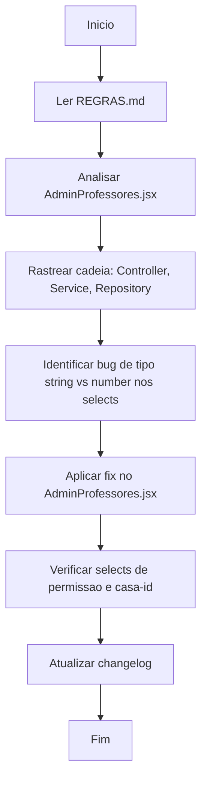

# Workflow: Correção Bug Edição de Professores

**Data:** 2026-04-29  
**Atividade:** Corrigir bug que impedia alteração de casa e perfil de permissão na edição de professores

---

## Fluxograma da Atividade



---

## Etapas

- [✅] Leitura do REGRAS.md
- [✅] Análise do `AdminProfessores.jsx`
- [✅] Rastreamento da cadeia completa: `useCrud` → `PUT /professores/:id` → controller → service → repository
- [✅] Diagnóstico do bug
- [⏳] Aplicação do fix
- [⏳] Atualização do changelog

---

## Diagnóstico Técnico

### Causa Raiz Identificada

O bug ocorre por **inconsistência de tipos** nos `<select>` controlados do React para `permissao` e `casa_id`.

**Problema 1 — `permissao` no `abrirEditar`:**
```js
setForm({ nome: p.nome, senha: '', permissao: p.permissao, casa_id: p.casa_id })
```
- `p.permissao` vem do JSON como `number` (ex: `1`)
- `<option value={1}>` → React converte para string `"1"`  
- `value={form.permissao}` = number `1`
- O React compara internamente como string, mas há casos de rerender que podem causar inconsistência visual e de envio

**Problema 2 — `casa_id` no onChange:**
```jsx
onChange={(e) => setForm({ ...form, casa_id: e.target.value })}
```
- `e.target.value` é sempre **string** (comportamento do DOM)
- Mas a inicialização tem `casa_id: p.casa_id` como **number**
- Mistura de tipos no mesmo campo ao longo do ciclo de vida do componente

### Solução

Garantir tipos consistentes desde a inicialização no `abrirEditar` e nos `onChange`:

1. Converter `permissao` e `casa_id` para **string** na inicialização do form de edição (ou garantir conversão para number consistente em todos os pontos)
2. A abordagem mais robusta: converter `permissao` e `casa_id` via `String()` no `abrirEditar`, já que os selects HTML sempre trabalham com strings

### Arquivos Modificados

- `frontend/src/views/admin/AdminProfessores.jsx`

---

## Erros Encontrados

Nenhum erro de execução identificado durante o fix.
