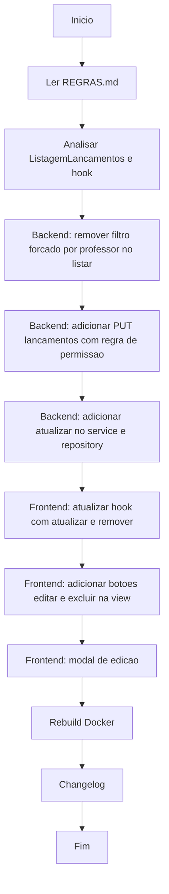

# Workflow: Listagem Completa de Lançamentos com Edição e Exclusão

**Data:** 2026-04-29
**Atividade:** Exibir todos os lançamentos na ListagemLancamentos, adicionar botões de edição/exclusão com controle de permissão e modal de edição.

---

## Fluxograma



---

## Etapas

- [✅] Leitura do REGRAS.md
- [✅] Analise dos arquivos
- [⏳] Backend: remover filtro forçado de professor_id no service.listar
- [⏳] Backend: endpoint PUT /lancamentos/:id + service.atualizar + repository.atualizar
- [⏳] Frontend: atualizar useListagemLancamentos
- [⏳] Frontend: view com botoes e modal

---

## Diagnostico

### Backend - service.listar (bug)
```js
if (usuario.permissao === 2) {
  filtros.professor_id = usuario.id; // Força filtro — professor so ve os seus
}
```
Esta logica impede que professores vejam todos os lancamentos. Deve ser removida para que TODOS vejam TUDO (a visibilidade do filtro de professor continua disponivel na UI).

### Regras de permissao para editar/deletar
- Professor (permissao=2): pode editar/deletar apenas lancamentos proprios (professor_id === usuario.id)
- Admin (permissao=1): pode editar/deletar qualquer lancamento
- O service ja implementa essa regra no deletar — replicar para atualizar

### Campos editaveis no lancamento
Por se tratar de dado historico com snapshot, apenas campos de correcao fazem sentido editar:
- pontuacao (correcao de valor)
- justificativa_snapshot (correcao do texto exibido)
- Nao editar: professor_id, casa_id, aluno_id, datas (dados de auditoria)
