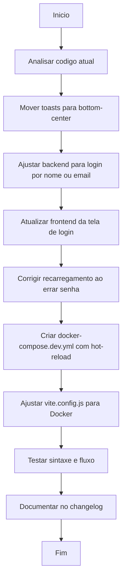

# Workflow - Correcao da Tela de Login e Ambiente Dev

- 📅 Data: 2026-04-30
- 🎯 Objetivo: Melhorar a experiencia de login no mobile, permitir autenticacao por nome ou email, e criar ambiente Docker de desenvolvimento com hot-reload.

## Fluxo da Atividade

## Checklist

- [x] Analisar codigo atual da tela de login, autenticacao e posicao dos toasts
- [x] Ajustar posicao dos toasts de erro/sucesso para mobile (mover de top-right para bottom-center)
- [x] Permitir login por nome ou email no backend (repository + service + controller)
- [x] Atualizar frontend da tela de login para aceitar nome ou email (label, placeholder, hook)
- [x] Remover limitacao implicita de 20 caracteres no fluxo de login (backend e frontend)
- [x] Corrigir recarregamento da pagina ao errar senha (interceptor Axios)
- [x] Destacar campos em vermelho ao errar credenciais
- [x] Criar docker-compose.dev.yml para desenvolvimento com hot-reload
- [x] Ajustar vite.config.js para funcionar dentro do container Docker
- [x] Testar fluxo completo e revisar codigo
- [x] Atualizar workflow e changelog conforme REGRAS.md

## Observacoes

- Nenhum erro encontrado durante a revisao.
- A validacao de tamanho de senha (6-20) permanece apenas nos fluxos de criacao e alteracao de senha, nao afetando o login.
- O interceptor de resposta do Axios foi ajustado para nao redirecionar na rota `/auth/login`, evitando recarregamento e perda dos dados preenchidos.
- Ao errar as credenciais, os campos `identificador` e `senha` recebem erro no estado, ativando a borda vermelha do componente `Input` e a mensagem abaixo de cada campo.
- O ambiente de desenvolvimento Docker (`docker-compose.dev.yml`) utiliza volumes montados para hot-reload no frontend (Vite) e backend (nodemon), eliminando a necessidade de recompilar a imagem a cada mudanca.
