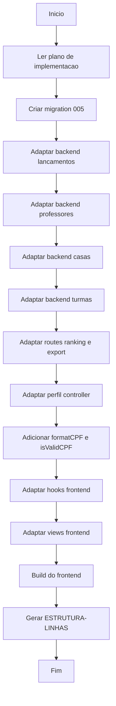

# Workflow — Remodelação v3 Professores e Lançamentos

## Etapas

- [✅] Leitura do plano de implementacao e aprovacao do usuario
- [✅] Migration 005: cpf UNIQUE, nome UNIQUE, telefone UNIQUE, email UNIQUE + DROP/CREATE lancamentos
- [✅] lancamentos.repository.js: campos de snapshot puro
- [✅] lancamentos.service.js: snapshots + complemento + permissao por nome
- [✅] lancamentos.controller.js: filtros por texto
- [✅] professores.repository.js: cpf, email, telefone no SELECT e criar
- [✅] professores.service.js: limpeza digitos, UNIQUE constraint handling
- [✅] professores.controller.js: novos campos
- [✅] casas.repository.js: remover atualizar, cascade NULL
- [✅] casas.service.js: remover atualizar
- [✅] casas.controller.js: remover atualizar
- [✅] casas.routes.js: remover PUT
- [✅] turmas.service.js: nome read-only, verificar FK ao deletar
- [✅] ranking.routes.js: JOIN por texto
- [✅] export.routes.js: novos campos + filtros por texto + cpf/email/telefone
- [✅] perfil.controller.js: cpf no SELECT + limpar digitos telefone
- [✅] formatters.js: formatCPF()
- [✅] validators.js: isValidCPF() com algoritmo de digitos verificadores
- [✅] useAdminProfessores.js: cpf, email, telefone, validacao CPF
- [✅] useAdminCasas.js: remover edicao
- [✅] useAdminTurmas.js: nome read-only
- [✅] useLancarPontos.js: campo complemento
- [✅] useListagemLancamentos.js: filtros por texto, permissao por nome
- [✅] useMeusLancamentos.js: filtro por texto
- [✅] AdminProfessores.jsx: campos CPF/Email/Telefone + validacao
- [✅] AdminCasas.jsx: remover edicao
- [✅] AdminTurmas.jsx: nome read-only
- [✅] ListagemLancamentos.jsx: novos campos + complemento
- [✅] LancarPontos.jsx: campo complemento
- [✅] Perfil.jsx: cpf read-only + telefone cru
- [✅] Build do frontend sem erros
- [✅] Gerar ESTRUTURA-LINHAS.md

## Erros Encontrados

- Erro de sintaxe no formatters.js: formatCPF foi inserido antes do fechamento de formatPhone. Corrigido reescrevendo o arquivo completo.
- Erros de "Invalid character" por uso de \r explícito na reescrita. Corrigido usando line endings nativas (LF).
