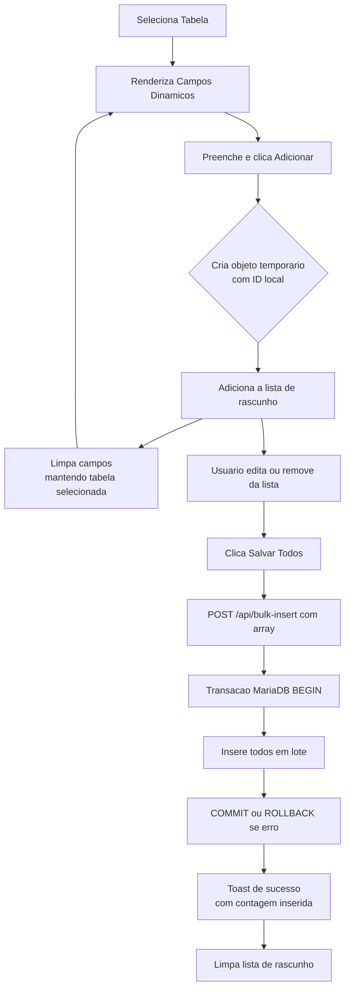

# Arquitetura — Cadastro Rápido (Bulk Insert)

## 1. Visao Geral

Tela unificada para cadastro em lote de Alunos, Professores, Turmas e Justificativas. O usuario seleciona a tabela, preenche os campos, adiciona a uma lista de rascunho (sem enviar ao servidor), e so no final clica "Salvar Todos" para persistir tudo de uma vez via transacao MariaDB.

---

## 2. Fluxo de UX



---

## 3. Frontend — `frontend/src/views/admin/CadastroRapido.jsx`

### 3.1 Configuracao de Metadados

```javascript
const CONFIG_TABELAS = {
  alunos: {
    nome: 'Alunos',
    endpoint: '/bulk-insert',
    campos: [
      { name: 'nome', label: 'Nome Completo', type: 'text', required: true },
      { name: 'turma_id', label: 'Turma', type: 'select', source: '/turmas', required: true },
      { name: 'casa_id', label: 'Casa', type: 'select', source: '/casas', required: false }
    ],
    resumo: (item, opcoes) => {
      const turma = opcoes.turmas?.find(t => t.id === item.turma_id)?.nome || item.turma_id
      return `${item.nome} — Turma: ${turma}`
    }
  },
  professores: {
    nome: 'Professores',
    endpoint: '/bulk-insert',
    campos: [
      { name: 'nome', label: 'Nome', type: 'text', required: true },
      { name: 'senha', label: 'Senha Provisoria', type: 'password', required: true },
      { name: 'permissao', label: 'Permissao', type: 'select', options: [
        { value: 1, label: 'Admin' },
        { value: 2, label: 'Professor' }
      ], required: true },
      { name: 'casa_id', label: 'Casa Vinculada', type: 'select', source: '/casas', required: true }
    ],
    resumo: (item) => item.nome
  },
  turmas: {
    nome: 'Turmas',
    endpoint: '/bulk-insert',
    campos: [
      { name: 'nome', label: 'Nome da Turma', type: 'text', required: true },
      { name: 'turno', label: 'Turno', type: 'select', options: [
        { value: 'Matutino', label: 'Matutino' },
        { value: 'Vespertino', label: 'Vespertino' },
        { value: 'Noturno', label: 'Noturno' }
      ], required: true }
    ],
    resumo: (item) => `${item.nome} — ${item.turno}`
  },
  justificativas: {
    nome: 'Justificativas',
    endpoint: '/bulk-insert',
    campos: [
      { name: 'nome', label: 'Descricao', type: 'text', required: true },
      { name: 'pontos', label: 'Pontuacao', type: 'number', required: true }
    ],
    resumo: (item) => `${item.nome} — ${item.pontos} pts`
  }
}
```

### 3.2 Estados da View

| Estado | Tipo | Descricao |
|--------|------|-----------|
| `tabelaAtiva` | `string \| null` | Chave da tabela selecionada |
| `formData` | `object` | Valores dos campos do formulario atual |
| `rascunho` | `array` | Itens adicionados, cada um com `_idLocal: string` |
| `editandoLocalId` | `string \| null` | `_idLocal` do item sendo editado (veio da lista) |
| `salvando` | `boolean` | Flag de loading durante POST |
| `opcoesFk` | `object` | Cache de options carregadas dos endpoints FK |

### 3.3 Comportamento de Editar da Lista

Ao clicar "Editar" em um item do rascunho:

1. O item e removido do array `rascunho`
2. Seus dados sao carregados em `formData`
3. `editandoLocalId` recebe o `_idLocal` (apenas para rastreamento visual)
4. Usuario altera o que precisar e clica "Adicionar" novamente
5. Um novo `_idLocal` e gerado e o item volta ao rascunho

Isso evita estados complexos de "modo edicao" e reutiliza o fluxo de adicionar.

### 3.4 Renderizacao Condicional dos Campos

O formulario itera sobre `CONFIG_TABELAS[tabelaAtiva].campos` e renderiza:

- `type: 'text'` → componente `Input` (existente)
- `type: 'number'` → componente `Input` com `type="number"`
- `type: 'password'` → componente `Input` com `type="password"`
- `type: 'select'` com `options` → componente `Select` (existente) com options inline
- `type: 'select'` com `source` → `Select` carregando dados do endpoint via `useFetch`

Para selects com `source`, a view usa `useFetch` para carregar os dados quando `tabelaAtiva` muda e armazena em `opcoesFk`.

### 3.5 Validação Cliente

Antes de adicionar ao rascunho:

- Todos os campos `required: true` devem estar preenchidos
- Campos `type: 'number'` devem ser numeros validos
- Exibir toast de erro com campo faltante

### 3.6 Layout Proposto (Mobile First)

```
+------------------------------------------+
|  [Select: Escolha a tabela...]           |
+------------------------------------------+
|  Nome Completo *                         |
|  [________________________]              |
|                                          |
|  Turma *            Casa                 |
|  [Select...]        [Select...]          |
|                                          |
|  [        + Adicionar à Lista         ]  |
+------------------------------------------+
|  Lista de Rascunho (3 itens)             |
|  ┌────────────────────────────────────┐  |
|  │ João Silva — Turma: 6º A    [E][X] │  |
|  │ Maria Souza — Turma: 6º B   [E][X] │  |
|  │ Pedro Lima  — Turma: 7º A   [E][X] │  |
|  └────────────────────────────────────┘  |
|                                          |
|  [         Salvar Todos (3)           ]  |
+------------------------------------------+
```

---

## 4. Backend — Endpoint `/api/bulk-insert`

### 4.1 Arquivos a Criar

| Arquivo | Responsabilidade |
|---------|-----------------|
| `backend/src/controllers/bulkInsert.controller.js` | Recebe HTTP, valida tabela, chama service |
| `backend/src/services/bulkInsert.service.js` | Valida array, hasheia senhas se necessario, chama repository |
| `backend/src/repositories/bulkInsert.repository.js` | Executa transacao MariaDB |
| `backend/src/routes/bulkInsert.routes.js` | Define POST / com middleware de admin |

### 4.2 Payload Esperado

```json
{
  "tabela": "alunos",
  "dados": [
    { "nome": "João Silva", "turma_id": 1, "casa_id": 2 },
    { "nome": "Maria Souza", "turma_id": 1, "casa_id": 3 }
  ]
}
```

### 4.3 Resposta de Sucesso

```json
{
  "message": "2 alunos cadastrados com sucesso",
  "insertedCount": 2,
  "ids": [101, 102]
}
```

### 4.4 Transacao no Repository

```javascript
async inserirLote(tabela, dados) {
  const connection = await db.getConnection();
  try {
    await connection.beginTransaction();
    const ids = [];
    for (const item of dados) {
      const cols = Object.keys(item).join(',');
      const vals = Object.values(item);
      const placeholders = vals.map(() => '?').join(',');
      const [res] = await connection.query(
        `INSERT INTO ${tabela} (${cols}) VALUES (${placeholders})`,
        vals
      );
      ids.push(res.insertId);
    }
    await connection.commit();
    return { count: ids.length, ids };
  } catch (err) {
    await connection.rollback();
    throw err;
  } finally {
    connection.release();
  }
}
```

### 4.5 Validacoes de Seguranca no Service

1. **Whitelist de tabelas:** So aceita `alunos`, `professores`, `turmas`, `justificativas`
2. **Validacao de campos obrigatorios:** Cada tabela tem schema fixo
3. **Hash de senha:** Para tabela `professores`, aplica `bcryptjs.hashSync(senha, 10)` em cada item
4. **Sanitizacao:** Nunca concatena nome de tabela sem verificar na whitelist
5. **Autorizacao:** Middleware `apenasAdmin` (agora verifica `permissao !== 1`)

---

## 5. Integracao com Sistema Existente

### 5.1 Rotas

**`backend/src/app.js`:**

```javascript
const bulkInsertRoutes = require('./routes/bulkInsert.routes');
app.use('/api/bulk-insert', bulkInsertRoutes);
```

**`frontend/src/App.jsx`:**

```jsx
import CadastroRapido from './views/admin/CadastroRapido'
// ...
<Route path="cadastro-rapido" element={<RotaAdmin><CadastroRapido /></RotaAdmin>} />
```

### 5.2 Navbar

Adicionar link "Cadastro Rápido" no menu admin (apenas para `isAdmin`).

---

## 6. Tabelas Excluidas do Cadastro Rápido

| Tabela | Motivo |
|--------|--------|
| **casas** | Cadastro individual simples (so 2 campos), mantem `AdminCasas.jsx` |
| **lancamentos** | Logica complexa (justificativas customizadas, snapshots, FKs multiplas), mantem `AdminLancamentos.jsx` |

---

## 7. Reutilizacao de Componentes Existentes

| Componente | Uso na View |
|------------|-------------|
| `Input.jsx` | Campos text, number, password |
| `Select.jsx` | Campos select (inline e FK) |
| `Button.jsx` | Botao "Adicionar", "Salvar Todos" |
| `Card.jsx` | Card de cada item do rascunho |
| `LoadingSpinner.jsx` | Estado de salvando |

---

## 8. Design System e Paleta de Cores

A view **Cadastro Rápido** segue estritamente o tema escuro definido em [`agentes/paleta-cores.md`](agentes/paleta-cores.md). Todos os elementos usam as classes Tailwind já configuradas, **sem criar cores inline ou classes CSS ad hoc**.

### Mapeamento de Elementos

| Elemento da Tela | Classes Tailwind | Token da Paleta |
|-----------------|------------------|-----------------|
| **Fundo da página** | `bg-background-900` | `background-900` `#0f172a` |
| **Card do formulário** | `bg-background-800 border border-background-600 rounded-xl` | `background-800` / `background-600` |
| **Card do rascunho** | `bg-background-800 border border-background-600 hover:bg-background-700` | `background-800` / `background-700` |
| **Inputs / Selects** | `input` (classe utilitária do projeto) | `background-700` `#334155` |
| **Labels** | `label` (classe utilitária) | `gray-300` |
| **Placeholders** | `placeholder:text-gray-500` | `gray-500` |
| **Botão "Adicionar"** | `btn-primary` | `primary-500` `#f59e0b` hover `primary-600` `#d97706` |
| **Botão "Salvar Todos"** | `btn-primary` | `primary-500` com glow/shadow |
| **Ícone Editar** | `text-gray-500 hover:text-primary-400` | `primary-400` `#fbbf24` |
| **Ícone Remover** | `text-gray-500 hover:text-red-400` | `red-400` |
| **Texto principal** | `text-white` | `white` |
| **Texto secundário** | `text-gray-400` | `gray-400` |
| **Contador de itens** | `text-primary-300` | `primary-300` `#fde68a` |
| **Borda do select ativo** | `focus:ring-primary-500/50 focus:border-primary-500` | `primary-500` |
| **Scrollbar** | `scrollbar-track-background-800 scrollbar-thumb-background-500` | `background-800` / `background-500` |

### Comportamento de Hover e Foco

- **Inputs:** Ao focar, borda dourada (`primary-500`) com ring translúcido (`primary-500/50`).
- **Cards do rascunho:** Hover sutil (`background-700`) para indicar interatividade.
- **Botões:** Transição suave via `transition-colors` do Tailwind.
- **Ícones de ação:** Gray padrão, mudam para cor de destaque no hover.

### Reutilização de Componentes (DRY)

Em vez de criar elementos estilizados do zero, a view **deve usar** os componentes existentes que já respeitam a paleta:

| Componente Existente | Uso |
|---------------------|-----|
| `Input.jsx` | Todos os campos text, number, password |
| `Select.jsx` | Seletor de tabela e selects de FK |
| `Button.jsx` | Botões primários e secundários |
| `Card.jsx` | Wrapper dos cards de rascunho |
| `LoadingSpinner.jsx` | Estado de salvando |

Isso garante consistência visual em todo o sistema e evita divergência de estilos.

---

## 9. Decisoes Tecnicas

### 8.1 Por que nao reutilizar `useCrud`?

O `useCrud` faz POST/PUT/DELETE individual e recarrega a lista apos cada operacao. A view de Cadastro Rápido precisa:

- Acumular dados localmente sem enviar ao servidor
- Enviar tudo de uma vez
- Nao recarregar lista (nao ha lista para recarregar nesta view)

Portanto, usa `api.post` diretamente no momento do "Salvar Todos".

### 8.2 Por que transacao no banco?

Se um insert falhar (ex: violacao de FK, nome duplicado), toda a operacao e revertida. Isso evita:

- Dados parcialmente inseridos
- Inconsistencia quando o usuario espera que tudo seja salvo
- Necessidade de rollback manual

### 8.3 Por que `_idLocal` em vez de indice?

Usar `crypto.randomUUID()` ou `Date.now()` como `_idLocal` permite:

- Editar e remover itens sem depender do indice do array
- Evitar bugs de re-rendering quando a lista muda
- Facilitar animacoes de entrada/saida

---

## 10. Implementacao Futura — Views de Listagem/Edicao

As views admin existentes (`AdminAlunos.jsx`, `AdminTurmas.jsx`, etc.) podem ser:

- **Mantidas** para listagem e edicao individual
- **Substituidas** por uma view generica de listagem usando `CrudTable.jsx`

Isso e uma decisao posterior. O foco desta arquitetura e exclusivamente o **INSERT em lote**.
